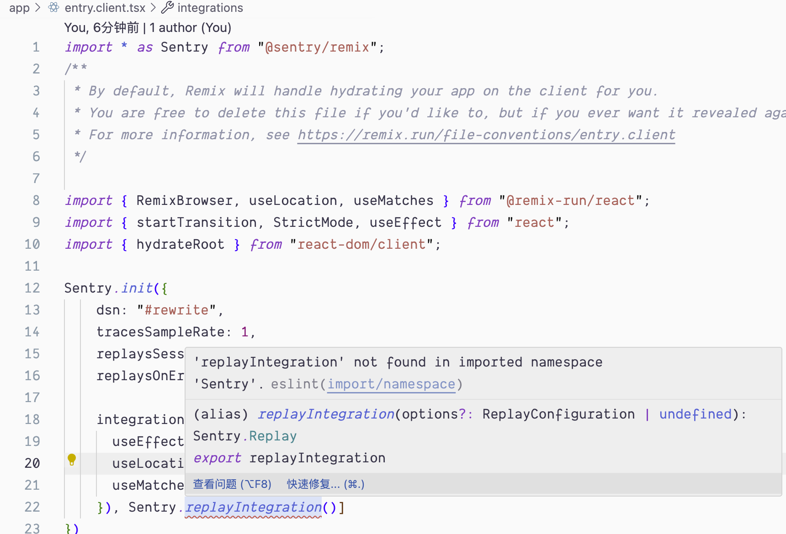

# repo for Reproduce the issue: remix + pnpm + sentry eslint namespace error

## Environment

- apple sillicon macos Sonoma 14.4.1
- ESLint v2.4.4
- pnpm v8.15.4
- "@remix-run/node": "^2.9.2"
- "@remix-run/react": "^2.9.2"
- "@remix-run/serve": "^2.9.2"
- "@sentry/remix": "^7.114.0"
- "@sentry/vite-plugin": "^2.16.1"

## How to start this project

```sh
  pnpm install
```

## check the code 

```sh
  pnpm dev
```

check the code at `app/entry.client.app: 24`

```tsx
Sentry.replayIntegration(),

// 'replayIntegration' not found in imported namespace 'Sentry'.
```



## How was this project created

### remix init

run `pnpm dlx create-remix@latest`

```sh
% pnpm dlx create-remix@latest
Packages: +198
++++++++++++++++++++++++++++++++++++++++++++++++++++++++++++++++++++++++++++++++++++++++++++++++++++++++++++++++++++++++++++++++++++++++++++++++++++++++++++++++++++++++++++++++++
Progress: resolved 198, reused 197, downloaded 1, added 198, done

 remix   v2.9.2 💿 Let's build a better website...

   dir   Where should we create your new project?
         ./remix-vite-sentry-namespace-error

      ◼  Using basic template See https://remix.run/guides/templates for more
      ✔  Template copied

   git   Initialize a new git repository?
         Yes

  deps   Install dependencies with pnpm?
         Yes

      ✔  Dependencies installed

      ✔  Git initialized

  done   That's it!

         Enter your project directory using cd ./remix-vite-sentry-namespace-error
         Check out README.md for development and deploy instructions.

         Join the community at https://rmx.as/discord
```

### sentry setup

run `pnpm dlx @sentry/wizard@latest -i remix`

```sh
% pnpm dlx @sentry/wizard@latest -i remix
Packages: +132
++++++++++++++++++++++++++++++++++++++++++++++++++++++++++++++++++++++++++++++++++++++++++++++++++++++++++++++++++++++++++++++++++++
Progress: resolved 132, reused 132, downloaded 0, added 132, done
Running Sentry Wizard...
version: 3.22.1 | sentry-cli version: 1.77.3
Sentry Wizard will help you to configure your project
Thank you for using Sentry :)
Skipping connection to Sentry due files already patched

┌   Sentry Remix Wizard 
│
◇   ────────────────────────────────────────────────────────────────────────────────────────────────╮
│                                                                                                   │
│  The Sentry Remix Wizard will help you set up Sentry for your application.                        │
│  Thank you for using Sentry :)                                                                    │
│                                                                                                   │
│  Version: 3.22.1                                                                                  │
│                                                                                                   │
│  This wizard sends telemetry data and crash reports to Sentry. This helps us improve the Wizard.  │
│  You can turn this off at any time by running sentry-wizard --disable-telemetry.                  │
│                                                                                                   │
├───────────────────────────────────────────────────────────────────────────────────────────────────╯
│
◇  Are you using Sentry SaaS or self-hosted Sentry?
│  Sentry SaaS (sentry.io)
│
◇  Do you already have a Sentry account?
│  Yes
│
●  If the browser window didn't open automatically, please open the following link to log into Sentry:
│  
│  https://sentry.io/[REWRITE]
│
◇  Login complete.
│
◇  Select your Sentry project.
│  gowxx/javascript-remix
│
◇  Installed @sentry/remix with PNPM.
│
◆  Added auth token to .sentryclirc for you to test uploading source maps locally.
│
◆  Created .sentryclirc.
│
◆  Added .sentryclirc to .gitignore.
│
◇  Installed @sentry/vite-plugin with PNPM.
│
◆  Added the Sentry Vite plugin to vite.config.ts and enabled source maps
│
●  We recommend checking the modified file after the wizard finished to ensure it works with your build setup.
│
◆  Created .env.sentry-build-plugin with auth token for you to test source map uploading locally.
│
◆  Added .env.sentry-build-plugin to .gitignore.
│
◆  Successfully instrumented root route root.tsx.
│
●  Found entry files entry.client.tsx and entry.server.tsx.
│
◆  Successfully initialized Sentry on client entry point entry.client.tsx
│
▲  Could not find function handleError in entry.server.tsx. Creating one for you.
│
◆  Instrumented handleError in entry.server.tsx
│
◆  Successfully initialized Sentry on server entry point entry.server.tsx.
│
◇  Do you want to create an example page ("/sentry-example-page") to test your Sentry setup?
│  Yes
│
●  Created sentry example page at app/routes/sentry-example-page.tsx.
│
└  
Sentry has been successfully configured for your Remix project.

You can now deploy your project to see Sentry in action.

To learn more about how to use Sentry with Remix, visit our documentation:
https://docs.sentry.io/platforms/javascript/guides/remix/


🎉  Successfully set up Sentry for your project 🎉
```
